*This project has been created as part of the 42 curriculum by bamagere.*

<br><br><br>

<a id="pipex"></a>

<h1 align="center"><span style="color:#7f03c7;">so_long​</span></h1>

<br>
<p align="center">
  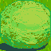
  
  
  
  
  
  
</p>
<p align="center">
  
  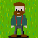
  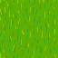
  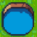
  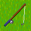
  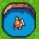
  
</p>
<p align="center">
  
  
  
  
  
  
  
</p>
<br><br><br><br>

---

Public disclaimer: this project has been made by a student, during his learning journey, while full time working. There will be errors, improvements, and some easter eggs. Have fun and press (space) to yourself.

---
<br><br>

<p><h2><span style="color: #7f03c7;">Summary</span></h2></p>

- [Description](#description)
  - [Project goals](#goals)
  - [Game concept](#concept)
  - [Allowed functions](#allowed)
  - [Project structure](#structure)
  - [How it works](#works)
    - [1- Map parsing](#mapparsing)
    - [2- Game loop](#gameloop)
    - [3- Events & loop hook](#event)
    - [4- Rendering system](#renderingsystem)
    - [5- Bonus](#bonus)
  - [Notes about rendering](#notesaboutrendering)
- [Instructions](#instructions)
  - [Build](#build)
  - [Usage](#usage)
  - [Controls in-game](#controls)
- [Resources](#resources)
  - [Notes](#notes)
  - [Improvement](#improvement)
  - [AI usage](#ia)

<br>
<br>

<a id="description"></a><p><h2><span style="color: #7f03c7;">Description</span></h2></p>

`so_long` is a 42 project about **2D game development using MiniLibX**.

The goal is to build a small tile-based game where the player must:
- collect all collectibles
- reach the exit
- avoid enemies

The project introduces:
- graphical rendering with MiniLibX
- event-driven programming (keyboard, window)
- game state management
- map parsing and validation

---


<a id="goals"></a><p><h3><span style="color: #d48ffc;">Project goals</span></h3></p>

This project is designed to help you practice:
- using an external library (MiniLibX)
- window management (`mlx_init`, `mlx_new_window`)
- image rendering (`mlx_put_image_to_window`)
- event handling (`mlx_hook`, `mlx_loop`)
- parsing and validating a map
- structuring a small game engine
- managing memory and resources cleanly

**Architecture** : 
The project is split by responsibility.  
Parsing validates the map, game logic updates positions and rules, rendering draws the state, animation updates frames, and cleanup handles memory. This separation makes the project easier to debug, easier to read, and less likely to collapse.

---

<a id="concept"></a><p><h3><span style="color: #d48ffc;">Game concept</span></h3></p>

Imagine a small `2D grid-based world`:

- each cell = a **tile**
- the player moves from tile to tile
- walls block movement
- collectibles must all be picked
- exit only becomes active once all collectibles are gathered

Bonus adds:
- enemies (`M`)
- animations
- HUD (score display in the window)
- a power ability **(the power of love)**:
  - cast love power forward
  - travels tile by tile
  - puts enemies to sleep for 5 moves

---

<a id="allowed"></a><p><h3><span style="color: #d48ffc;">Allowed functions</span></h3></p>


```
open, close, read, write, malloc, free, perror, strerror, exit
•All functions of the math library (-lm compiler option, man man 3 math)
•All functions of the MiniLibX
•gettimeofday()
•ft_printf and any equivalent YOU coded
```

---

<a id="structure"></a><p><h3><span style="color: #d48ffc;">Project structure (for 42 correction)</span></h3></p>

```bash
so_long/
├── textures/
├── maps/
├── lib/
│   ├── libft/
│   ├── gnl/
│   └── printfs/
├── minilibx-linux/
├── sources/
│   ├── mandatory/
│   │   ├── check_map_utils_two.c
│   │   ├── check_map_utils.c
│   │   ├── check_map.c
│   │   ├── game_completion.c
│   │   ├── game_control.c
│   │   ├── game_utils.c
│   │   ├── main.c
│   │   ├── moves.c
│   │   ├── window_draw.c
│   │   └── window_utils.c
│   │── bonus/
│   │   ├── main_bonus.c
│   │   ├── images/
│   │   │   ├── images_destroy_1_bonus.c
│   │   │   ├── images_destroy_2_bonus.c
│   │   │   ├── images_destroy_3_bonus.c
│   │   │   ├── images_loader_1_bonus.c
│   │   │   ├── images_loader_2_bonus.c
│   │   │   ├── images_loader_3_bonus.c
│   │   │   └── images_loader_4_bonus.c
│   │   ├── moves/
│   │   │   ├── moves_basic_bonus.c
│   │   │   ├── moves_monsters_1_bonus.c
│   │   │   ├── moves_monsters_2_bonus.c
│   │   │   ├── moves_monsters_3_bonus.c
│   │   │   ├── moves_monsters_4_bonus.c
│   │   │   ├── moves_power_1_bonus.c
│   │   │   ├── moves_power_2_bonus.c
│   │   │   └── moves_power_3_bonus.c
│   │   ├── utils/
│   │   │   ├── animation_1_bonus.c
│   │   │   ├── animation_2_bonus.c
│   │   │   ├── checker_1_bonus.c
│   │   │   ├── checker_2_bonus.c
│   │   │   ├── checker_3_bonus.c
│   │   │   ├── flood_fill_bonus.c
│   │   │   ├── game_control_bonus.c
│   │   │   ├── game_rules_bonus.c
│   │   │   ├── handle_input_bonus.c
│   │   │   └── time_utils_bonus.c
│   │   └── window/
│   │       ├── window_1_init_bonus.c
│   │       ├── window_2_update_bonus.c
│   │       ├── window_3_utils_bonus.c
│   │       ├── window_4_end_bonus.c
│   │       ├── windraw_1_features_1_bonus.c
│   │       ├── windraw_1_features_2_bonus.c
│   │       ├── windraw_2_border_bonus.c
│   │       └── windraw_3_hud_bonus.c
│   ├── so_long.h
│   └── so_long_bonus.h
├── Makefile
└── README.md
```
---

<br>
<a id="works"></a>
<p><h3><span style="color: #d48ffc;">How it works (step by step)</span></h3></p>

*This section explains the internal logic of the game step by step.  
You can skip all this reading part by clicking here: [go to instructions](#instructions).*

<a id="mapparsing"></a>

1) **Map parsing**

The map is read from a .ber file and must:

- be rectangular
- be surrounded by walls (1)
- contain:
  - exactly 1 player (P)
  - exactly 1 exit (E)
  - at least 1 collectible (C)
  - optionally enemies (M) (bonus).

A **flood fill** ensures the map is solvable.  
```
Starting from the player position, the algorithm spreads through every reachable non-wall tile. If a collectible or the exit remains unreachable after the fill, the map is rejected. This prevents “valid-looking” maps that are impossible to finish.
```

---

<a id="gameloop"></a>

2) **Game loop**

The game is driven by MiniLibX.  
Keyboard and window events are handled through hooks, while the loop hook updates time-based animations.  
In short: input changes the game state, the loop updates animations, and rendering displays the current state.

---

<a id="event"></a>

3) **Events & loop hook**

`mlx_key_hook` reacts only when the player presses a key, such as movement, escape, or power usage.  
`mlx_loop_hook` runs continuously while the window is open and is used for animations, power propagation, and frame timing. This separation keeps gameplay actions and visual updates independent.

Flow:  
Player presses a key → handle_input  
-> Game updates (movement, power, etc.)  
--> draw_all() redraws the full frame  
---> idle_anim_hook updates animations  

---
<a id="renderingsystem"></a>

4) **Rendering system**

The game is redrawn in layers every frame.
The usual order is: map tiles first, then exit, power effects, monsters, player, border, and HUD. This order matters because elements drawn later appear on top of previous ones. 

*Why full redraw?*

```
MiniLibX draws directly into the window and does not automatically manage a clean scene.
A full redraw ensures that old sprites, previous positions, and animation leftovers disappear correctly. It is simpler, safer, and appropriate for a small tile-based game.
```

*Camera system for bonus:*  
```
The camera does not strictly keep the player centered at all times.
Instead, the game displays a window-sized portion of the map, and the camera follows the player only when possible.

When the player is in the middle of the map:

- the camera moves
- the world shifts around the player
- the player appears centered

When the player is near the edges of the map:

- the camera stops moving (because it reached map limits)
- the player moves inside the window instead

This means:

- sometimes the world moves (camera tracking)
- sometimes the player moves on screen (edge cases)

The visible area is defined by:

- a camera offset (cam_x, cam_y)
- a viewport (view_w, view_h)

In short, the game tries to center the player, but respects map boundaries, so the camera becomes static at the edges.
This approach is similar to what I implemented in my cub3D project.
```
---

<a id="bonus"></a>

5) **Bonus:** 
```
The easiest noticeable change is the addition of animations for the player and the monster(s). 
```
<p align="center">
  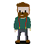
  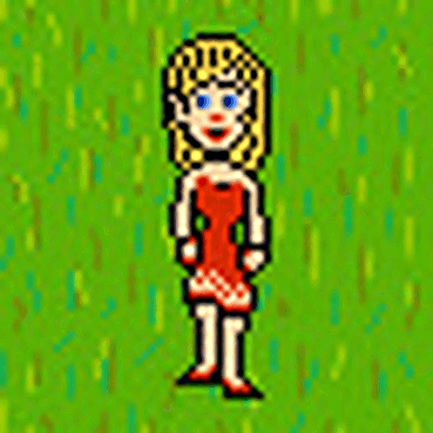
</p>

```
Originally, they were more complex and big plans were made. But due to un-saved work at 2 a.m. and time management, they all disappeared. So I decided to make it minimal as, excepted for the monster, all the sprites are made by myself and a tribute to my Microsoft Paint skills from childhood. 

Next, you'll find different features of my work, saved as WIP (work in progress):
```

<p align="center">
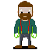

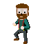
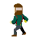
</p>

```
As you can see down here, this was the original monster look. I first modified it by adding my floor under. It was imported and guaranteed free + usable from the website "Spriters-resources":
```
[Spriters-resources : Mica](https://www.spriters-resource.com/custom_edited/startropicscustoms/asset/508070/)
<p align="center">
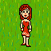
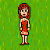
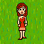
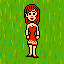
</p>

---

<br>

**Power system** : Pressing `SPACE` triggers: love_power  
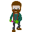

```
The power starts from the tile in front of the hero, using the hero’s current direction.
It can be blocked by walls, interact with monsters, and travel tile by tile across the map. If it hits a monster, the monster enters sleep mode and temporarily stops being dangerous.
```

**Power propagation and frames:**  
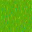
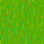
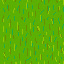
 
```
The power animation uses several frames per tile.
Each tile plays its animation before the power moves forward to the next tile.
```

**Pathfinding**
```
After all collectibles are collected, monsters switch from basic movement to chase mode.
They use BFS pathfinding to find the shortest accessible path to the player while respecting walls, collectibles, exits, and other monsters.
```

**BFS**
```
"Breadth-First Search" explores the map from the player position and assigns a distance to each reachable tile.
Each monster then checks the four adjacent tiles and moves to the one with the lowest distance. This makes enemies follow the shortest path without needing complex AI, because thankfully the monsters do not need a master’s degree for this project.
```

**Memory**
```
All allocated memory must be freed before exiting: maps, monster arrays, MLX images, the window, and the display.
The project separates normal exits, error exits, and image-loading failures so cleanup stays consistent.

So even if you unset the DISPLAY, exit will be clean.
```

**MLX behaviour**
```
MiniLibX may allocate internal resources when opening a display, creating a window, or loading images.
The project destroys every image with mlx_destroy_image, closes the window, destroys the display, and frees the MLX pointer. Some system-level MLX/X11 allocations may still appear as reachable depending on the environment.
```

---

<a id="notesaboutrendering"></a>
<p><h3><span style="color: #d48ffc;">Notes about rendering</span></h3></p>

MiniLibX does not use double buffering by default:  
- drawing happens directly on the window all elements must be redrawn each frame

To keep rendering clean:

- drawing is centralized in draw_all  
- game logic is separated from rendering
- map should not be modified during draw

---

<br>

<a id="instructions"></a>
<p><h2><span style="color: #7f03c7;">Instructions</span></h2></p>

<a id="build"></a>
<p><h3><span style="color: #d48ffc;">Build</span></h3></p>

Mandatory:
```bash
make
make + (download mlx from the official website + make)
```

Bonus:
```bash
make bonus
make bonus+ (download mlx from the official website + make bonus)
```

Clean:
```bash
make clean
make fclean
make re
make rebonus

make fclean+ (remove mlx + fclean)
make re+ (download mlx from the official website + re)
make rebonus+ (download mlx from the official website + rebonus)
```

---

<a id="usage"></a>
<p><h3><span style="color: #d48ffc;">Usage</span></h3></p>

```bash
(valgrind) ./so_long <path_to_map>
```
For mandatory:
```bash
./so_long maps/map.ber
```
or for bonuses:
```bash
./so_long maps/monsters/map.ber
```

<br>

You'll also find a directory with already prepared wrong maps inside accessible at : `solong/maps/wrongs`

<a id="controls"></a>
<p><h3><span style="color: #d48ffc;">Controls in-game</span></h3></p>

`W / ↑` = move up  
`S / ↓` = move down  
`A / ←` = move left  
`D / →` = move right  
`ESC`   = exit game  
`SPACE` = use power (bonus)  

<br> <br>

<a id="resources"></a>
<p><h2><span style="color: #7f03c7;">Resources</span></h2></p>

- MiniLibX documentation
- man mlx
- man X11
- 2D tile rendering tutorials
- [Make Your Own Raycaster Part 1](https://www.youtube.com/watch?v=gYRrGTC7GtA&list=PLCXqoZAc8-tyDSaO8jnabOEFhdTQfx77_)
  - helped me think of how to map video games
- [Piskel](https://www.piskelapp.com/)
  - my only tool to draw pixel art
- [Convertio](https://convertio.co/fr/png-xpm/)
  - the conversion website I used to convert everything in anyway
- [Spriters-resources](https://www.spriters-resource.com/)
  - sprites for the monster found here


<a id="notes"></a>
<p><h3><span style="color: #d48ffc;">Notes</span></h3></p>
As a former student, I had more time to work on this project. And even with this extra time spent on bonuses, it is far from perfect. This project shows how efficient some decisions have to be taken. Yet, I tried my best to make it pleasant to play and read.

<a id="improvement"></a>
<p><h3><span style="color: #d48ffc;">Improvement</span></h3></p>

If I had to continue this project, I would: 
- have re-done the sprites and animations I lost
- Implement a Menu
- refactor the bfs so I have a global bfs map instead of calling a bfs for each monsters everytime
- calculate perfectly the frame so there is no glitch

<a id="ia"></a>
<p><h3><span style="color: #d48ffc;">AI usage</span></h3></p>

AI was used to:

- learn faster the MiniLibX documentation
- attempt to generate animations of several movement or frames out of my drawings. (None work well so I ended up doing everything myself)
- assist in debugging
- correct this README
- help in the creation of the ENDING images

<br> <br> 
<p> <h1 align="center">
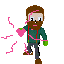
<i>Thank you for reading</i>
 
<h3 align="center"><i>bamagere</i> 
</p> 
<br>

[go to top ⤴](#pipex)

<br>

<p align="center">
  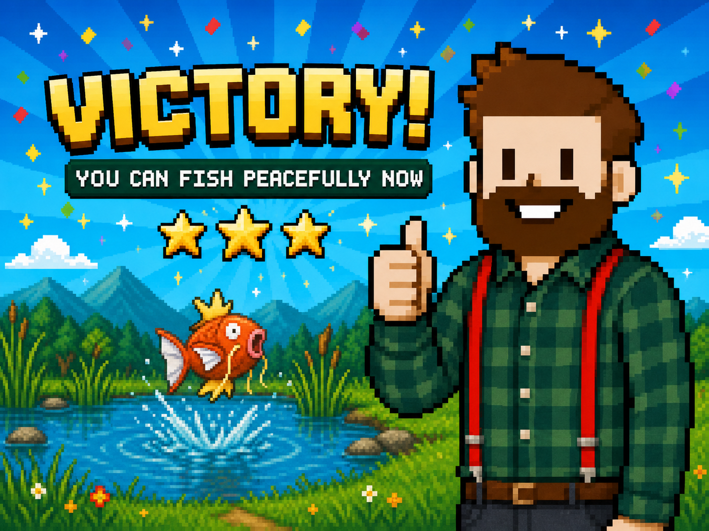

  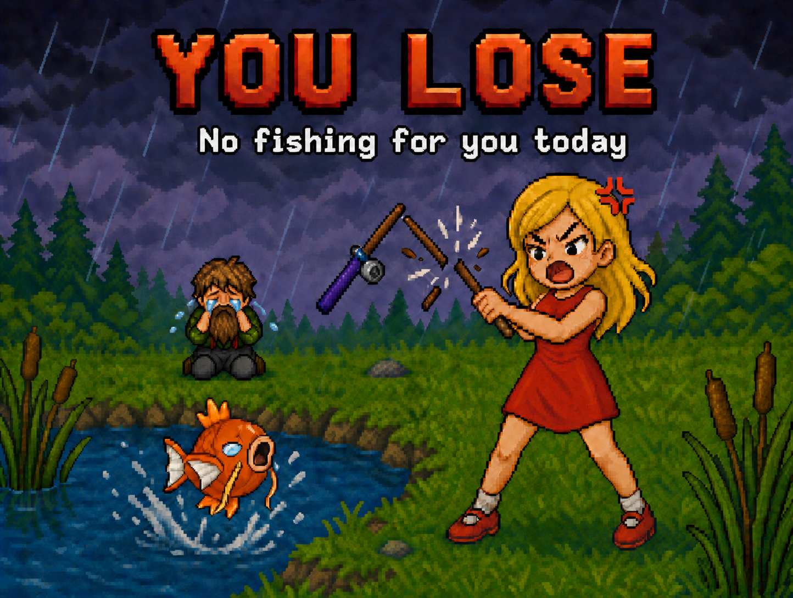
</p>
